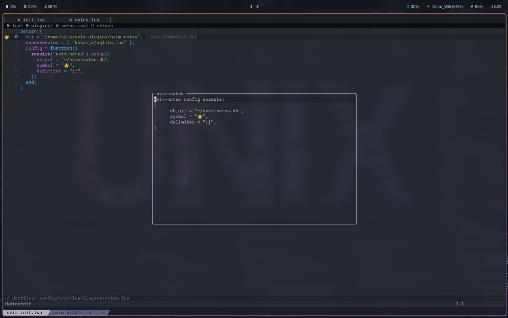

# nvim-notes

This is a note taking plugin for Neovim(similar to <a href="https://github.com/RutaTang/quicknote.nvim">RutaTang/quicknote.nvim</a>).
Easily create, edit and delete notes related to a specific line number in a buffer.
The notes are saved in a SQLite database, either a global database or project specific databases.



## Installation
```lua
-- lazy

{
	dir = "kilavila/nvim-notes",
	dependencies = { "kkharji/sqlite.lua" },
	config = function()
		require("nvim-notes").setup()
	end,
}
```

## Configuration
```lua
{
    -- WARNING: By default nvim-notes creates a database in each project!
    -- the following config will make nvim-notes use a global database for all projects
    db_url = "~/nvim-notes.db", -- optional
    symbol = "⭐", -- optional
    delimiter = ";;", -- optional
}
```

### db_url
By default `db_url` is `nvim-notes.db`, which will create a new database in each project you open with Neovim!
Configuring nvim-notes like the example above makes nvim-notes use a global database.

## Commands
There's no default keybinds for nvim-notes, but here are the available commands:

```
NotesNew: create a new note on the current line.
NotesEdit: edit the note of the current line.
NotesSave: save the current note you are in(floating buffer) and closes the floating buffer.
NotesDelete: delete the note on the current line.
NotesLoad: reload the notes for the current buffer(happens automatically on BuffEnter).
```

Exmaple mapping:
```lua
vim.keymap.set("n", "<leader>nn", ":NotesNew<cr>")
vim.keymap.set("n", "<leader>ns", ":NotesSave<cr>")
vim.keymap.set("n", "<leader>ne", ":NotesEdit<cr>")
vim.keymap.set("n", "<leader>nd", ":NotesDelete<cr>")
```
